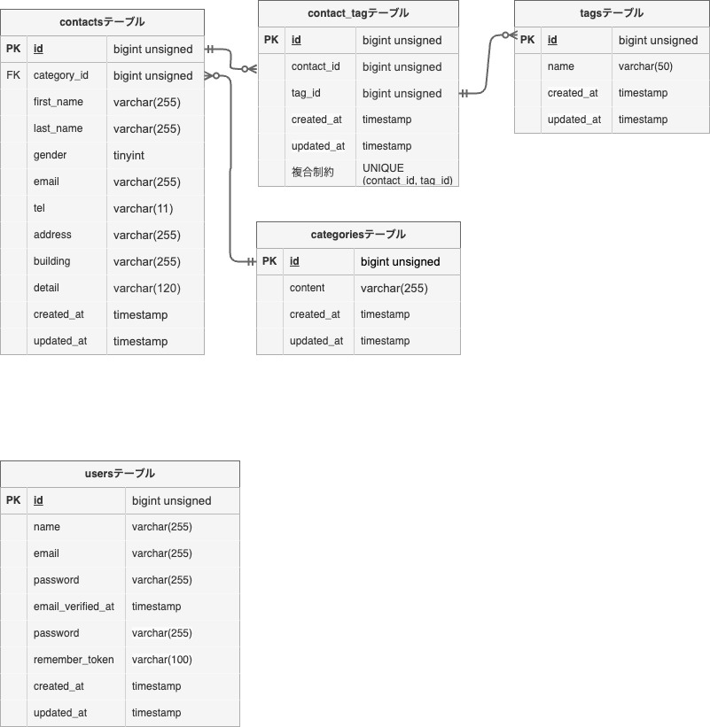

# お問い合わせフォーム管理システム

Laravel 10を使用して開発したお問い合わせ管理システムです。

一般ユーザーはお問い合わせフォームから問い合わせを送信でき、管理者はログイン後にお問い合わせの検索・閲覧・削除・CSVエクスポートを行うことができます。

また、タグ機能を実装しており、お問い合わせとタグを多対多で管理できる構成となっています。

REST APIを提供しており、お問い合わせデータの取得・登録・更新・削除に対応しています。

---

# 主な機能

## 一般ユーザー

- お問い合わせ入力
- 入力内容確認
- お問い合わせ送信
- サンクスページ表示

## 管理者

- ログイン
- お問い合わせ一覧表示
- お問い合わせ検索
- お問い合わせ詳細表示
- お問い合わせ削除
- CSVエクスポート
- タグ管理
  - 作成
  - 編集
  - 削除

## API

- お問い合わせ一覧取得
- お問い合わせ詳細取得
- お問い合わせ登録
- お問い合わせ更新
- お問い合わせ削除
- カテゴリ一覧取得
- タグ一覧取得

---

# ER図



## リレーション

- Category ： Contact = 1 : N
- Contact ： Tag = N : N
- Contact ： contact_tag = 1 : N
- Tag ： contact_tag = 1 : N

---

# 使用技術

| 項目 | 技術 |
|------|------|
| PHP | 8.2 |
| Laravel | 10.x |
| データベース | MySQL 8.0 |
| Webサーバー | Nginx |
| フロントエンド | Vite |
| CSSフレームワーク | Tailwind CSS 3.4 |
| 認証 | Laravel Fortify |
| API認証 | Laravel Sanctum |
| 開発環境 | Docker |
| コンテナ管理 | Laravel Sail |
| DB管理 | phpMyAdmin |
| バージョン管理 | Git / GitHub |

---

# APIエンドポイント一覧

## お問い合わせAPI

| Method | URI | 概要 |
|---------|---------|---------|
| GET | /api/v1/contacts | お問い合わせ一覧取得 |
| GET | /api/v1/contacts/{contact} | お問い合わせ詳細取得 |
| POST | /api/v1/contacts | お問い合わせ登録 |
| PUT | /api/v1/contacts/{contact} | お問い合わせ更新 |
| DELETE | /api/v1/contacts/{contact} | お問い合わせ削除 |

## カテゴリAPI

| Method | URI | 概要 |
|---------|---------|---------|
| GET | /api/v1/categories | カテゴリ一覧取得 |

## タグAPI

| Method | URI | 概要 |
|---------|---------|---------|
| GET | /api/v1/tags | タグ一覧取得 |

---

# 設計書

- [ルート設計書](docs/route-design.md)
- [ER図](docs/er.png)

---

# 環境構築

## リポジトリをクローン

```bash
git clone <リポジトリURL>
cd contact-form-app
```

## Composer依存関係をインストール

```bash
composer install
```

## 環境変数ファイルを作成

```bash
cp .env.example .env
```

## データベース設定

`.env` を以下のように設定してください。

```env
DB_CONNECTION=mysql
DB_HOST=mysql
DB_PORT=3306
DB_DATABASE=laravel
DB_USERNAME=sail
DB_PASSWORD=password
```

## Sailコンテナ起動

```bash
./vendor/bin/sail up -d
```

エイリアス設定済みの場合

```bash
sail up -d
```

## アプリケーションキー生成

```bash
sail artisan key:generate
```

## マイグレーション・シーディング実行

```bash
sail artisan migrate --seed
```

## フロントエンド依存関係インストール

```bash
sail npm install
```

## Vite起動

```bash
sail npm run dev
```

---

# 開発環境URL

## アプリケーション

```text
http://localhost
```

## phpMyAdmin

```text
http://localhost:8080
```

---

# ディレクトリ構成

```text
docs/
├── er.drawio
├── er.png
└── route-design.md

app/
database/
resources/
routes/
```

---

# Pull Requestテンプレート


## 概要

Issue #◯ を実装しました。

## 実装内容

-
-
-

## 確認項目

- ローカル動作確認済み
- PHPUnit実行済み
- コード整形済み
- 不要なコメント削除済み

## 関連Issue

Closes #◯


---

# 作成者

川久保 大河